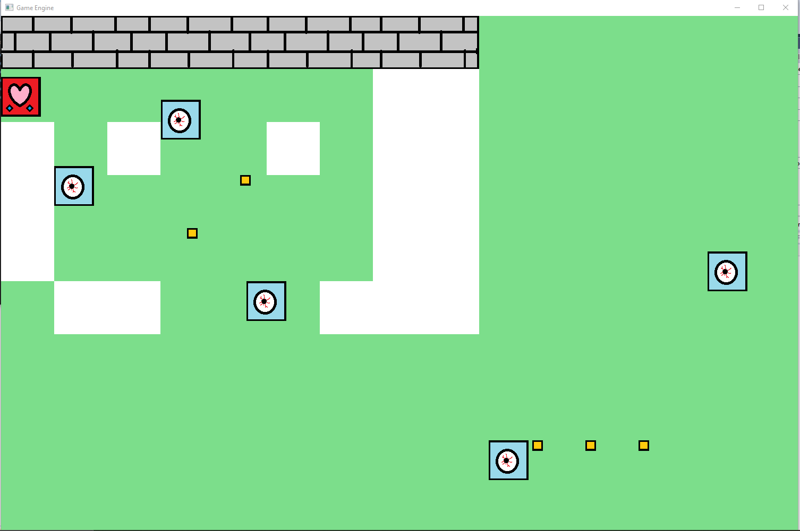

# GameEngineDev

Features: 
-Top down game board design 
-Player, Enemy, Environment Objects, Projectile, and Weapons 
-These elements can be added to the game world through the Source.txt file in json format. 
-Player: Can navigate the map, controlled by the user. 
-Enemy: Can have a custom movement pattern, does damage. 
-Environment Object: Immovable obstacle for the player. 
-Projectile: High damage obstacle which can hurt both the player and enemies.

Future Features: Given more time we would have liked to add these things 
-Moving projectiles which can be fired by the player or enemies 
-Interactable Objects which allow for great variation in gameplay 
-Side view support, jump physics 
-More complex collision detection ie. Circles

Default movement is wasd, can be changed by modifiying the values in the keybinds array. 
Press R to restart. 
Modify Source.txt to add or remove elements from the game. 

  

 
